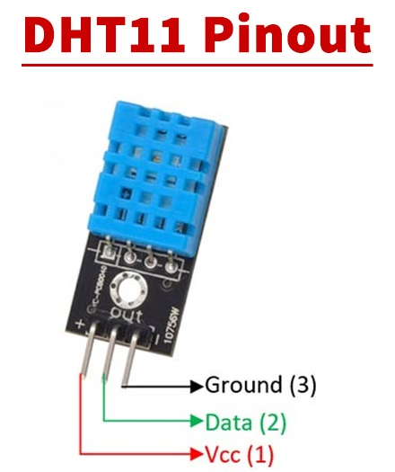

# DHT11 module

The DHT11 module is a temperature and humidity sensor that can be used to measure the ambient temperature and humidity in a given environment. It is typically used in applications where it is important to monitor and control the temperature and humidity, such as in greenhouses, laboratories, and other controlled environments.

| DHT11 | ESP32  | CONSTANT |
| ----- | ------ | -------- |
| GND   | GND    | -        |
| VCC   | 3.3V   | -        |
| Data  | GPIO15 | DHTPIN   |

The code in this repository uses the DHT11 module to measure the temperature and humidity using the DHT11 module, and then display the resulting values on the OLED display SSD1306. It also uses buttons to allow the user to interact with the system and control the display of the temperature and humidity.

