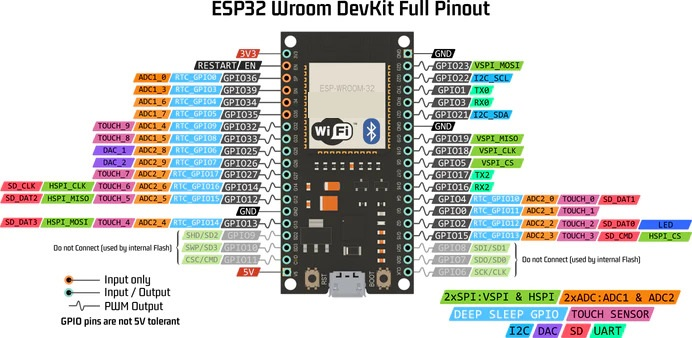
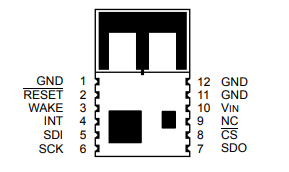
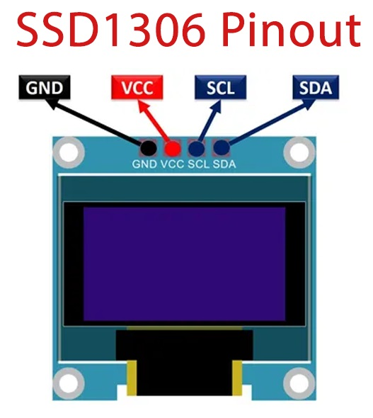
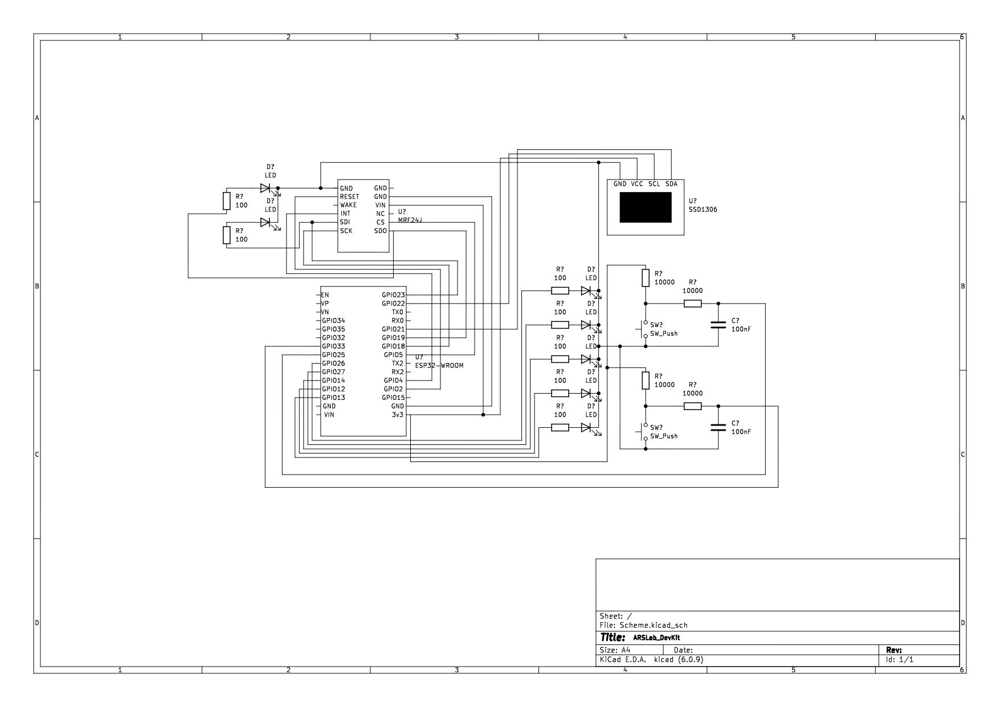

# ARSLab-Devkit

The ESP32 is a low-cost, low-power microcontroller with built-in Wi-Fi and Bluetooth connectivity. It is often used in Internet of Things (IoT) projects and can be programmed using the Arduino Integrated Development Environment (IDE) or other software development tools.

To use buttons, LEDs, and an OLED display SSD1306 with the ESP32, you can follow this electrical scheme:

1. The OLED display has a set of pins for power, ground, and data communication (I2C). These pins should be connected to corresponding pins on the ESP32.
2. The MRF24J module has a set of pins for power, ground, and data communication (SPI). These pins should be connected to corresponding pins on the ESP32.
3. The buttons can be connected to digital input pins on the ESP32, and a pull-down resistor should be used to ensure a stable input when the button is not pressed and a RC filter in order to reduce the **debouncing**.
4. The LEDs can be connected to digital output pins on the ESP32, and a current-limiting resistor should be used to prevent damage to the LED or the ESP32.

## PINs Mapping

| NAME       | ESP32  |
| ---------- | ------ |
| PIN_BTN1   | GPIO25 |
| PIN_BTN2   | GPIO33 |
| PIN_WHITE  | GPIO13 |
| PIN_BLUE   | GPIO12 |
| PIN_RED    | GPIO26 |
| PIN_YELLOW | GPIO27 |
| PIN_GREEN  | GPIO14 |
| PIN_RESET  | GPIO2  |
| PIN_CS     | GPIO5  |
| PIN_INT    | GPIO4  |

## MRF24J module

| MRF24J                    | ESP32  | CONSTANT  |
| ------------------------- | ------ | --------- |
| $\overline{\mbox{RESET}}$ | GPIO2  | PIN_RESET |
| INT                       | GPIO4  | PIN_INT   |
| SDI                       | GPIO23 | -         |
| SCK                       | GPIO18 | -         |
| SDO                       | GPIO19 | -         |
| $\overline{\mbox{CS}}$    | GPIO5  | PIN_CS    |
| VIN                       | 3.3V   | -         |
| GND (11)                  | GND    | -         |

## OLED display SSD1306

$\mbox{SCREEN\\_WIDTH = 128}$ 
$\mbox{SCREEN\\_HEIGHT = 64}$ 
$\mbox{OLED\\_RESET = -1 (sharing ESP32 reset pin)}$ 

| SSD1306 | ESP32  |
| ------- | ------ |
| GND     | GND    |
| VCC     | 3.3V   |
| SCL     | GPIO22 |
| SDA     | GPIO21 |

## Schematics

